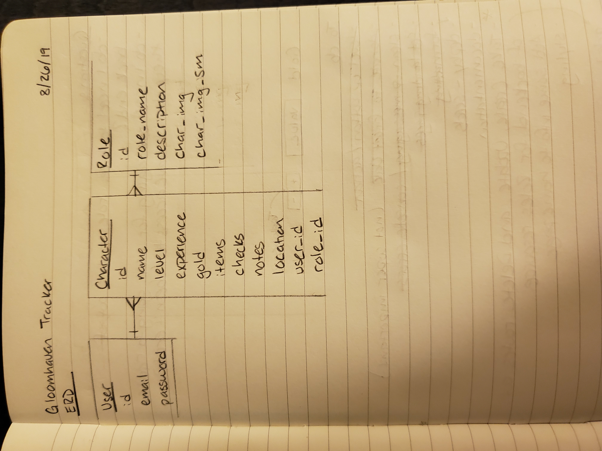

## Gloomhaven Character Tracker

### Description

This is a helper app used for tracking character stats for the game Gloomhaven. I play Gloomhaven with friends and have found the notebooks provided to be difficult to use and we always forget where we left off so I decided to make this app to help solve those problems.

### Links

[Frontend Repo](https://github.com/amandabeers/gloomhaven-tracker-client)
[Deployed Client](https://amandabeers.github.io/gloomhaven-tracker-client/)
[Deployed API](https://gloomhaven-tracker-api.herokuapp.com)

### Setup Steps

1. Fork and clone this repository
2. Run `bundle install` in the repo from the command line to install all dependencies
3. Run `bin/rails server` to launch the API server

### Technologies

- JavaScript
- React
- Ruby on Rails
- HTML5
- CSS3
- Bootstrap

### Planning and Development

Prior to writing any code I started planning out my relationships and resources in the database. I decided to create a resource to contain the available classes from the game with set information that a user could then use to create their own character. This way the user wouldn't need to replicate any information themselves that is alredy provided in the game. Then I started documenting features that I would want to be available to me if I were using this app in the form of user stories. Finally I drew wireframes which I continued to do throughtout my development process to help me build my components.

I built the backend first and tested the routes using curl scripts, then used seeds to populate the starter classes from the game into my roles resource before moving on to the front end. On the front end I started by creating index and show routes for both roles and characters then moved on to other CRUD actions. I spent a lot of time trying to decide how to provide the user with update actions for their character. I didn't want to have a single update feature that gave the user every possible field to update each time as this didn't really make sense to me in the context of the game. I settled on a system of giving the user different triggering events they could select that only gave them the possibly relevant forms to update.

### Unsolved Problems

- Add in player cards and modifier decks
- Add a resource to keep track of your party and the state of city
- Work on responsive design

### Entity Relationship Diagram (ERD)

ERDs:

  

### Catalog of Routes

#### Roles

| Verb   | URI Pattern            | Controller#Action |
|--------|------------------------|-------------------|
| GET    | `/roles`               | `roles#index`     |
| GET    | `/roles/:id`           | `roles#show`      |

#### Characters

| Verb   | URI Pattern            | Controller#Action   |
|--------|------------------------|---------------------|
| GET    | `/characters`          | `characters#index`  |
| GET    | `/characters/:id`      | `characters#show`   |
| POST   | `/characters`          | `characters#create` |
| PATCH  | `/characters/:id`      | `characters#update` |
| DELETE | `/characters/:id`      | `characters#destroy`|

#### Authentication Routes

| Verb   | URI Pattern            | Controller#Action |
|--------|------------------------|-------------------|
| POST   | `/sign-up`             | `users#signup`    |
| POST   | `/sign-in`             | `users#signin`    |
| PATCH  | `/change-password`     | `users#changepw`  |
| DELETE | `/sign-out`            | `users#signout`   |
